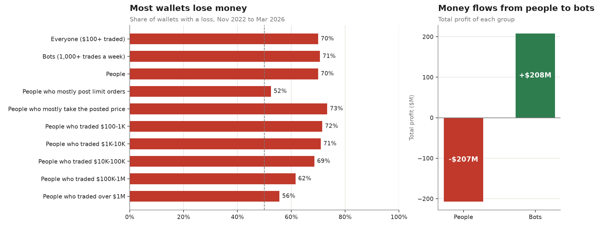
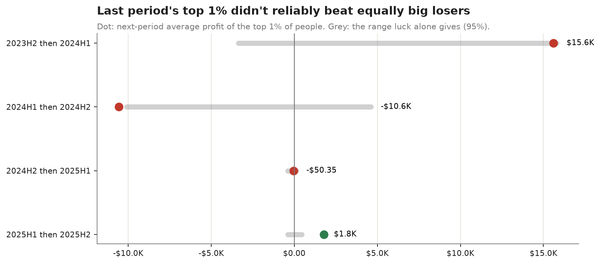
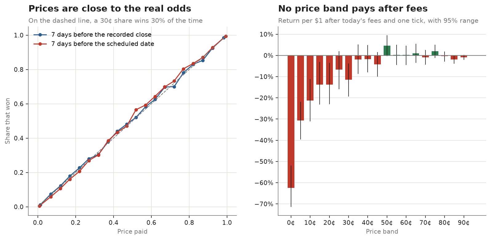
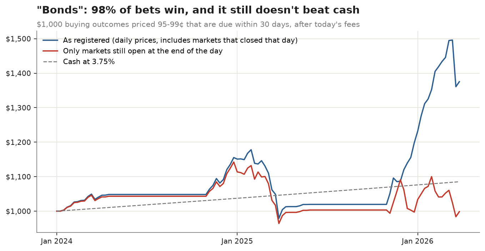
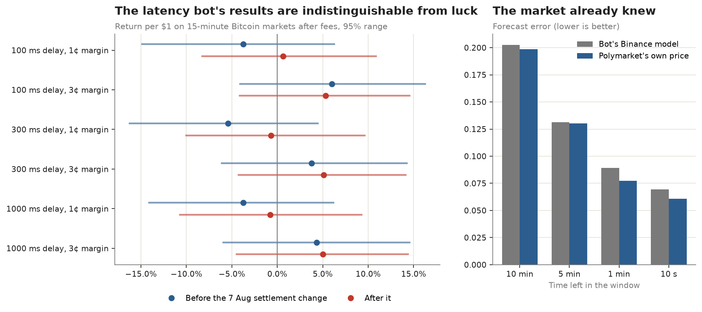
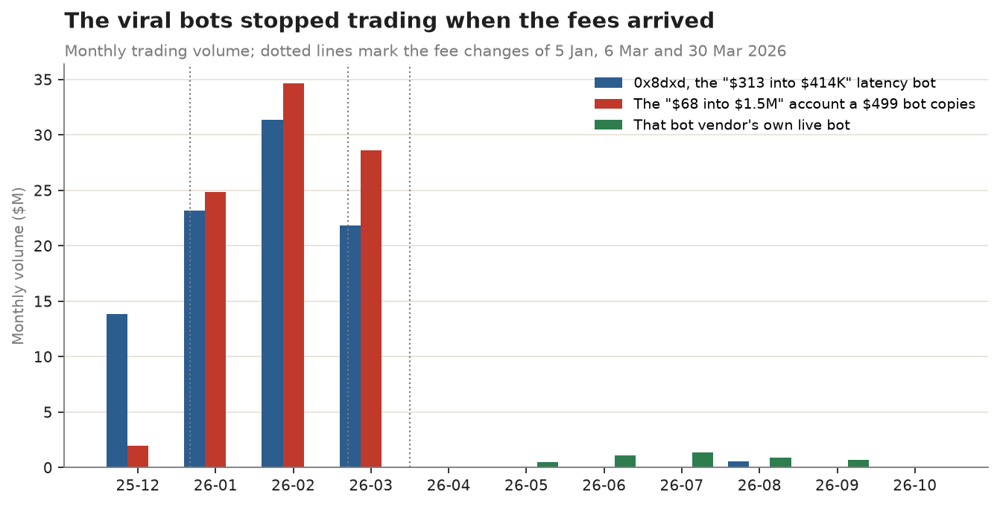

# Polymarket: is it alpha yet?

Generated 2026-10-06 by `experiments/polymarket/report.py` from the files in `results/`. Rules fixed in
advance in [preregistration.md](preregistration.md) (SHA-256 logged in `experiments/trials.jsonl` before any outcome data
was downloaded, with one logged clarification). 10 strategy versions were tried, all counted.

**Short answer: no.** Prices on Polymarket are close to the real odds, most wallets lose, the money flows from people to
bots, last period's winners don't reliably keep winning, and neither of the two strategies the viral posts sell (buying
"sure things" at 95-99¢, or racing Binance on 15-minute Bitcoin markets) beat cash or luck in our replays. The viral
bots were real, industrial-scale operations, and they stopped trading when Polymarket's fees arrived.

UK residents can't open positions on Polymarket anyway: it geoblocks the UK, and the Gambling Commission and FCA treat
it as off-limits to retail. No account was opened and no money was used.

| Question | Answer |
|---|---|
| Who wins? | 70% of wallets that traded $100 or more lost money. People lost $207M in total; bots made $208M. |
| Luck or skill? | Mostly luck. The top 1% of people beat equally large losers in 1 of 4 half-years. |
| Are the odds fair? | Yes, closely. After today's fees, no price band pays reliably; long shots lose heavily. |
| Do "bonds" (95-99¢) work? | No. 98.2% of bets win, but the portfolio made 1.4% a year against 3.75% cash. |
| Does the latency bot work? | No. No version beat luck; the market's own price forecast the outcome better than the bot's model. |
| The viral wallets? | Real, huge and automated, and they stopped trading in March 2026, when fees reached all crypto markets. |

## 1. Who wins and who loses



Data: profit for every Polymarket wallet from November 2022 to 29 March 2026, from the dataset behind Akey, Grégoire,
Harvie and Martineau (2026), "Who Wins and Who Loses in Prediction Markets?". We re-derived the headline figures with our
own definitions.

- **69.9%** of the 2,165,973 wallets that traded at least $100 lost money. The
  median wallet lost $3.51; a wallet at the 10th percentile lost $314.76.
- **People lost $207M; bots made $208M.** It's close to a straight
  transfer. "Bot" here means 1,000 or more trades a week, sustained.
- People who mostly **take the posted price** did worst: 73% lost, and together
  they lost $223M. People who mostly post limit orders roughly broke even.
- **The top 1% of wallets took 87% of all profit**; the top 0.1% took
  63%.
- Even people who traded more than $1M lost more often than not (56%).

These match independent analyses (Galaxy Research, Oct 2026: 69.2% of 2.9M accounts below break-even).

## 2. Luck or skill



If winning were skill, last half-year's top winners would keep beating everyone of similar size. We compared the top 1%
of people by profit in one half-year with equally large *losers* of the previous half-year, using 1,000 shuffles to see
what luck alone produces.

- The top 1% beat that luck range in **1 of 4** half-years, below the 3 required. In the 2024 election half-year
  they lost $10.6K each on average.
- The rank correlation between one half-year's profit and the next is close to zero
  (+0.01, +0.05, +0.00, +0.08).
- Copying winners would be worse still: a copier buys later, at worse prices, so their own next-period result is the best
  a copier could hope for.

## 3. Are the odds fair



For 29,058 resolved two-outcome markets, we took each side's price a week before the close and checked how
often it won.

- **Prices are close to the real odds.** Across the middle bands the share that won is within a few points of the price.
- **Long shots are a bad bet.** Measured from the date a buyer knows (the scheduled end), shares under 5¢ won
  0.5% of the time at an average price of 0.8¢: a loss of
  50% before any fees, 62% after.
- **Measured from the recorded close, the long-shot bias disappears.** That version quietly includes markets that closed
  early *because the long shot happened*, which is information nobody had a week before.
- **After today's fees and one tick of spread, no price band makes a reliable profit** in either version.

## 4. "Bonds": buying near-certain outcomes at 95-99¢



The pitch: buy outcomes priced 95-99¢ that resolve soon, collect the last few cents, repeat. We ran it on every eligible
market from January 2024 to March 2026 with $1,000, 2% per position, at most 10% of a day's volume, today's fees and a
tick of spread.

- As registered, it looked good: 99.0% of 5,397 bets won and it made
  15.6% a year (seven-day version: 11.9%). Even so, the 95% range
  (-4.4% to 42.7%) wasn't clear of cash, so it **failed the registered test**.
- **Most of that was an artefact.** For a market that closes during the day, its "daily price" is the last trade before it
  resolved, and knowing it was the last trade is hindsight. Buying only when the market was still open at the end of the
  day (added after seeing the results, and counted as extra trials), it made **1.4% a year**
  (seven-day: 0.0%), against 3.75% cash, with a worst fall of 16%.
- It is picking up pennies in front of a steamroller: about 1 bet in 56 loses
  the whole stake, and sports "certainties" alone lost $257.76 of the
  $1,000.

## 5. The 15-minute Bitcoin latency bot



The pitch: Binance moves first, Polymarket lags, so a bot buys the side Binance says is now likely. We replayed that bot
on recorded Polymarket order books (every 100 ms) for ten days drawn at random, five before and five after the 7 August
2026 switch to averaged settlement prices. Each order executes against the book after a delay of 100 ms, 300 ms or 1 s,
only at prices no worse than when the signal fired, and pays today's crypto taker fee.

- **No version passed.** The best retail-speed version (300 ms delay, 3¢ margin) averaged
  5.1% per $1 after the change and 3.8% before,
  but its ranges (-4.3% to 14.1% after) are what luck produces.
  It traded almost every window and won about half.
- **The market already knew.** Ten seconds before the close, Polymarket's own price forecast the outcome better than the
  bot's Binance model (error 0.061 against 0.070; a coin scores 0.250). One minute
  out: 0.077 against 0.089. The gaps the bot traded on were its own mistakes.
- The 57 days of order books we didn't draw are untouched. They are a clean holdout if anyone wants to test a specific
  version properly.

## 6. The viral wallets



- **0x8dxd**, the "$313 into $414K in a month" bot: $1.7M of trading profit from
  January to March 2026 on $76M of volume and 4,270,111 trades
  (about 33 a minute, around the clock). From April to October it
  traded $590.2K in total, against $76M in the three months
  before.
- **The "$68 into $1.5M" account** that a $499 bot advertises copying: $1.4M from
  January to March on $88M of volume. Since April: nothing.
- **That vendor's own bot**: $64.3K of trading profit since May on
  $4.7M of volume, plus $26.8K of rebates and
  rewards that a new retail account wouldn't get.

These were professional, high-frequency operations, not a laptop and $68. Fees on all crypto markets started on 6 March;
both stopped within weeks.

## Limitations

- Wallet profits end on 29 March 2026, just before fees reached most categories. Everything else applies today's fees to
  past prices: it answers "what would this earn now".
- Daily prices can't show the spread; we charge one tick. Real fills on thin markets would often be worse.
- The latency replay covers ten days and one fair-value model. Professional bots use faster feeds and post their own
  orders (makers pay no fees and earn rebates), which we didn't model.
- "Bot" is a trading-rate threshold, not a label. Some fast people count as bots and some slow bots as people.

## Reproduce

```bash
uv run python experiments/polymarket/fetch_data.py wallets && uv run python experiments/polymarket/fetch_data.py books
for t in wallets persistence calibration bonds latency latency_diagnostics viral_wallets report; do
  uv run python experiments/polymarket/$t.py
done
```
